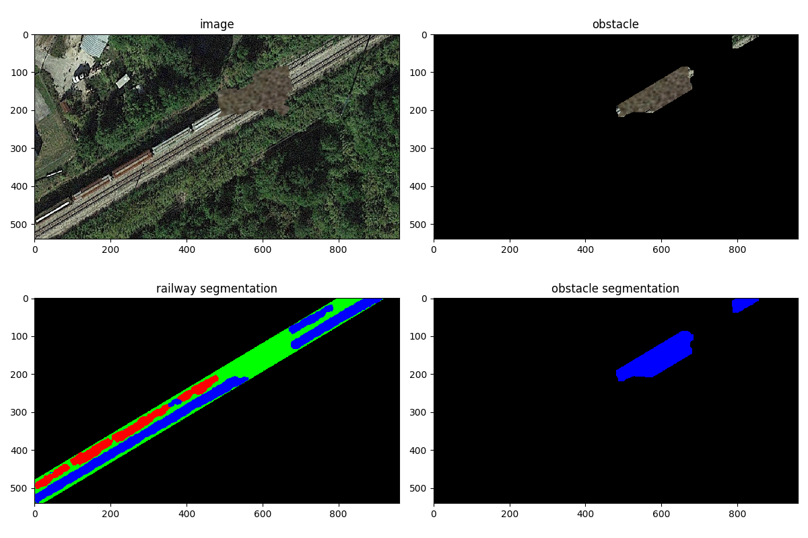
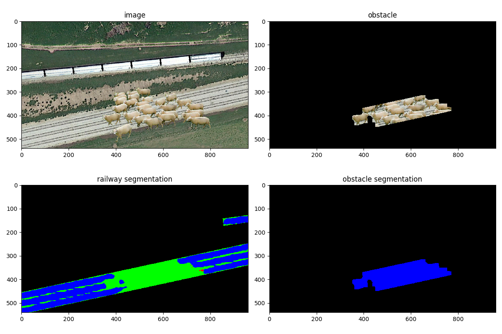
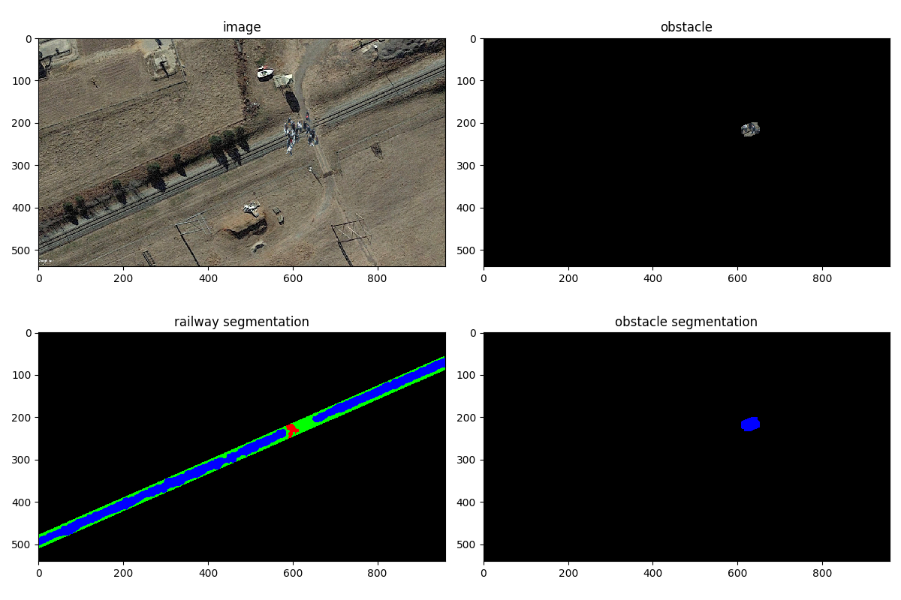
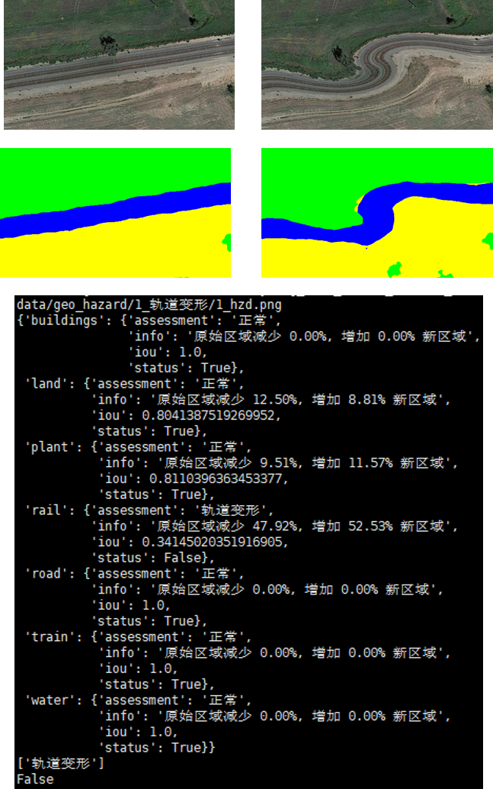
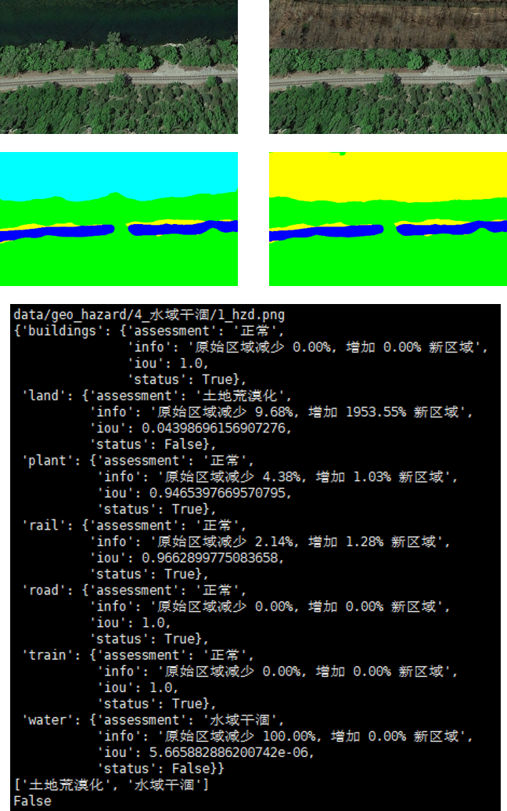
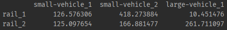
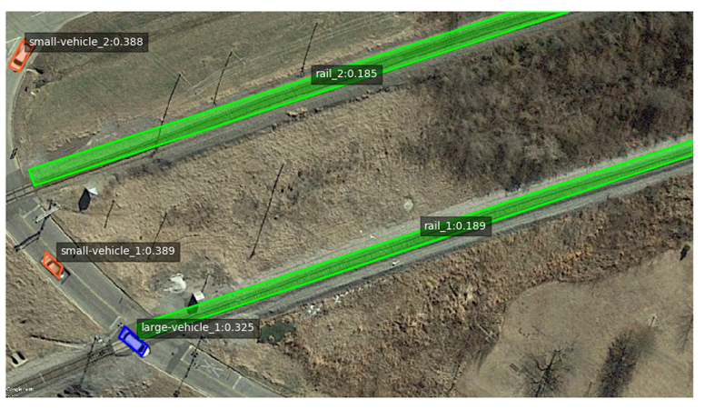
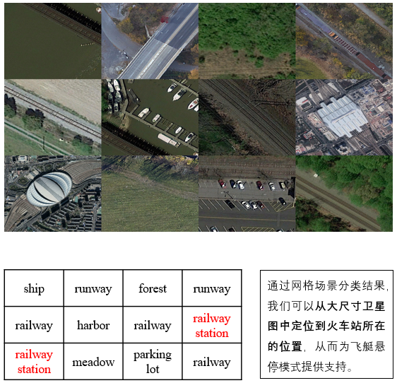
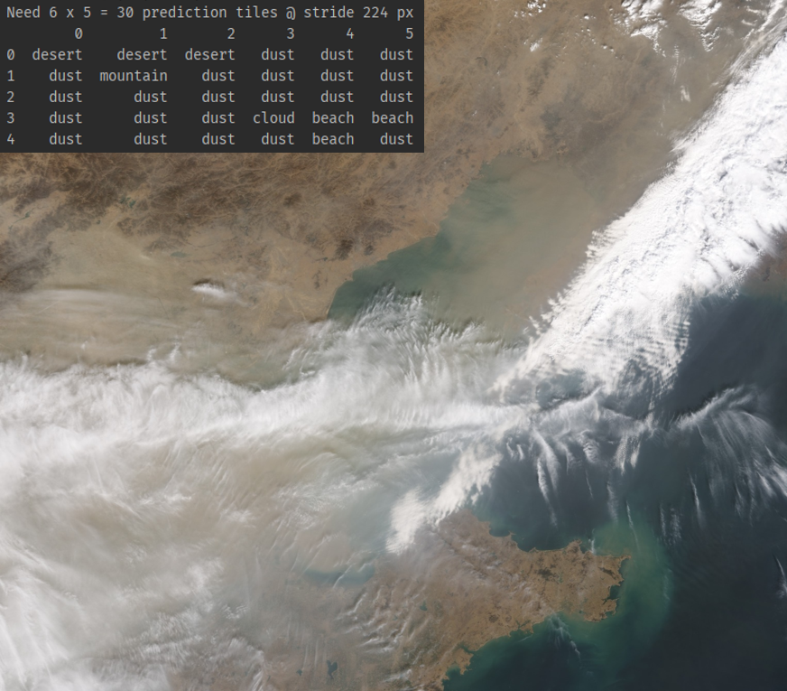

# RSRailway

- **RS_segmentation:** 7 classes:  'rail', 'plant', 'buildings', 'road', 'land', 'water', 'train'
- **RS_detection:** DOTA 15 classes + Railway 2 classses: 'train', 'rail'
- **RS_classification:** NWPU 45 classes + desert 1 class

## 分割

### 1. 异物入侵预警

    <b>边坡滑坡</b> 
     +
     =
    
    
    <b>羊群入侵</b>
    
    <b>行人穿行</b>
    

### 2. 地质灾害预警

分析异常状态下，各类别 iou 增减情况，给出地址灾害评估

<table>
    <tr>
        <th align='center'>轨道变形</th>
        <th align='center'>水域干涸</th>
    </tr>
    <tr>
        <td></td>
        <td></td>
    </tr>
</table>

## 检测

### 1. 异物入侵预警

定义预警类如汽车，保护类如铁轨，判断检测对象间距离，给出预警

    
    

## 分类

大尺寸卫星图图像，采用网格场景分类，快速得到地貌信息。

### 1. 车站定位 

    

### 2. 恶劣天气预警

    

## Reference

- BBAVectors-Oriented-Object-Detection: https://github.com/yijingru/BBAVectors-Oriented-Object-Detection
- [WACV2021] Oriented Object Detection in Aerial Images with Box Boundary-Aware Vectors ([arXiv](https://arxiv.org/pdf/2008.07043.pdf))
